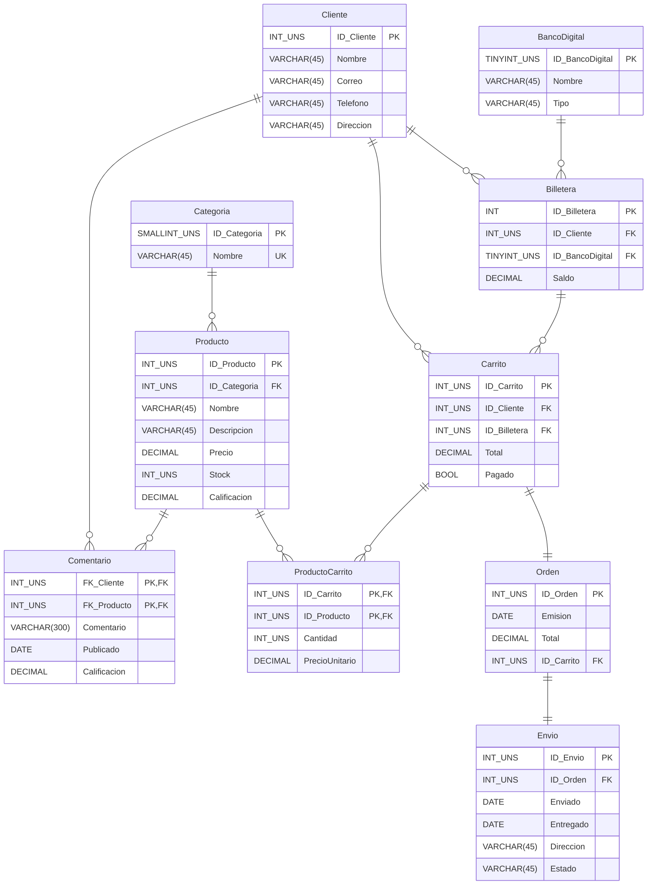

# TIenda-de-envios

## Procedimientos

Procedimientos almacenados

``` SQL
CREATE PROCEDURE InsBancoDigital (nombre VARCHAR(45), tipo VARCHAR(45))
BEGIN
    INSERT INTO BancoDigital(Nombre, Tipo)
    VALUES (nombre, tipo);
END;
CREATE PROCEDURE InsCategoria (unNombre VARCHAR(45))
BEGIN
    INSERT INTO Categoria(Nombre)
    VALUES (unNombre);
END;
CREATE PROCEDURE InsCliente (unNombre VARCHAR(45), unCorreo VARCHAR(60), unTelefono VARCHAR(10), unDireccion VARCHAR(60))
BEGIN
    INSERT INTO Cliente (Nombre,Correo,Telefono,Direccion)
    VALUES (unNombre, unCorreo, unTelefono, unDireccion);
END;

CREATE PROCEDURE InsBilletera ( unID_Cliente INT UNSIGNED, unID_BancoDigital TINYINT UNSIGNED, unSaldo DECIMAL(10,2) UNSIGNED)
BEGIN
    INSERT INTO Billetera( ID_Cliente, ID_BancoDigital, Saldo)
    VALUES ( unID_Cliente, unID_BancoDigital, unSaldo);
END;

CREATE PROCEDURE InsProducto (unNombre VARCHAR(300), unDescripcion VARCHAR(700), unPrecio DECIMAL(10,2) UNSIGNED , unStock INT UNSIGNED, unID_Categoria INT UNSIGNED)
BEGIN
    INSERT INTO Producto(Nombre, Descripcion, Precio, Stock, ID_Categoria)
    VALUES (unNombre, unDescripcion, unPrecio, unStock, unID_Categoria);
END;

CREATE PROCEDURE InsComentario (unID_Producto INT UNSIGNED, unID_Cliente INT UNSIGNED, unComentario VARCHAR(700), unEstrellas DECIMAL(2,1) UNSIGNED)
BEGIN
    INSERT INTO Comentario(ID_Producto, ID_Cliente, Publicado, Comentario, Estrellas)
    VALUES (unID_Producto, unID_Cliente,CURDATE() ,unComentario, unEstrellas);
END;

CREATE PROCEDURE InsCarrito(unID_Carrito INT UNSIGNED, unID_Cliente INT UNSIGNED, unID_Billetera TINYINT UNSIGNED)
BEGIN
    INSERT INTO Carrito (ID_Carrito, ID_Cliente, ID_Billetera)
    VALUES (unID_Carrito, unID_Cliente, unID_Billetera);
END;

CREATE PROCEDURE InsProductoCarrito ( unID_Carrito INT UNSIGNED, unID_Producto INT UNSIGNED, uncantidad INT UNSIGNED)
BEGIN
    SELECT uncantidad * precio INTO @total 
    FROM Producto
    WHERE ID_Producto=unID_Producto;

    INSERT INTO ProductoCarrito (ID_Carrito, ID_Producto, cantidad, precioUnitario)
    VALUES (unID_Carrito, unID_Producto, uncantidad, @total);
END;

```

Más prodecimientos

``` SQL
CREATE PROCEDURE MostrarProductos_Y_su_Stock_De (unIdCategoria INT)
BEGIN
    SELECT ID_Producto, Nombre, Stock
    FROM Producto
    WHERE ID_Categoria=unIdCategoria;
END;

-- Actualizar Stock

CREATE PROCEDURE StockReducir (unID_Producto INT, unStock INT UNSIGNED)
BEGIN
    SELECT stock INTO @stock
    FROM Producto 
    WHERE ID_Producto = unID_Producto;

    IF @stock >= unStock THEN
        UPDATE Producto
        SET stock = stock - unStock
        WHERE ID_Producto = unID_Producto;
    ELSE
        SIGNAL SQLSTATE '45000' SET MESSAGE_TEXT = 'Stock insuficiente.';
    END IF;
END;
CREATE PROCEDURE StockAumentar (unID_Producto INT, unStock INT UNSIGNED)
BEGIN
    UPDATE Producto
    SET stock = stock + unStock
    WHERE ID_Producto = unID_Producto;
END;

-- Cursor que recorre los productos pertenecientes al carrito y reduce el stock mediante el procedure StockReducir.

CREATE PROCEDURE CursorAftInsertOrden( unID_Carrito INT )
BEGIN
    DECLARE errorStock BOOLEAN DEFAULT FALSE;
    DECLARE done BOOLEAN DEFAULT FALSE;
    DECLARE v_idProducto INT;
    DECLARE v_Cantidad SMALLINT;

    DECLARE cursor1 CURSOR FOR SELECT ID_Producto, Cantidad
                               FROM ProductoCarrito
                               WHERE ID_Carrito = unID_Carrito;

    DECLARE CONTINUE HANDLER FOR NOT FOUND SET done = TRUE;
    DECLARE CONTINUE HANDLER FOR SQLSTATE '45000' SET errorStock=TRUE;

    OPEN cursor1;
        lector : LOOP
            FETCH cursor1 INTO v_idProducto, v_Cantidad;
            IF done THEN
                LEAVE lector;
            END IF;
            SET errorStock = FALSE;
            CALL StockReducir(v_idProducto, v_Cantidad);
            IF(errorStock) THEN
                SELECT CONCAT('Error al reducir stock del producto con ID: ', v_idProducto);
            END IF;
        END LOOP lector;
    CLOSE cursor1;
END;

-- En base a la cantidad de comentarios, y las estrellas asignadas, sacar el promedio y actualizar la tabla Producto.
CREATE PROCEDURE ActualizarPromedioEstrellas(unID_Producto INT)
BEGIN
    DECLARE v_promedio FLOAT;

    SELECT AVG(Estrellas) INTO v_promedio
    FROM Comentario
    WHERE ID_Producto = unID_Producto;

    UPDATE Producto
    SET PromedioEstrellas = v_promedio
    WHERE ID_Producto = unID_Producto;
END;

-- Crear un procedimiento que calcule el tiempo pendiente de envío de un pedido.
CREATE PROCEDURE TiempoPendienteEnvio(unID_Envio INT)
BEGIN
    SELECT DATEDIFF(Emision, CURDATE()) AS Dias_Pendientes, IF(E.Enviado IS NULL, 'No Enviado', 'Enviado') AS Estado, IF(E.Entregado IS NULL, 'En camino', 'Entregado') AS Estado_Entrega
    FROM Envio E
    JOIN Orden O ON E.ID_Orden = O.ID_Orden
    WHERE E.ID_Envio = unID_Envio;
END;
```

# Triggers

``` SQL
CREATE TRIGGER aftUpdCarrito_Pagado AFTER UPDATE ON Carrito FOR EACH ROW
BEGIN
    IF(old.Pagado != new.Pagado) THEN
        IF EXISTS(SELECT * FROM ProductoCarrito WHERE ID_Carrito=old.ID_Carrito) THEN
           IF(old.Total > (SELECT Saldo FROM Billetera WHERE ID_Billetera = old.ID_Billetera)) THEN
                SIGNAL SQLSTATE '45000'
                SET MESSAGE_TEXT = 'Saldo insuficiente para pagar el carrito.';
            ELSE
                INSERT INTO Orden (Emision, Total, ID_Carrito)
                VALUES (CURDATE(), old.Total, old.ID_Carrito);
            END IF;
        ELSE
            SIGNAL SQLSTATE '45000'
            SET MESSAGE_TEXT = 'El carrito no tiene productos para pagar.';
        END IF;
    
    END IF;
END;
-- Luego de confirmarse el pago, reducir stock de cada producto del carrito.
CREATE TRIGGER aftInsertOrden AFTER INSERT ON Orden FOR EACH ROW
BEGIN
    CALL CursorAftInsertOrden(new.ID_Carrito);

    SELECT ID_Billetera INTO @billetera
    FROM Carrito
    WHERE ID_Carrito = new.ID_Carrito;

    UPDATE Billetera
    SET Saldo = Saldo - new.Total
    WHERE ID_Billetera = @billetera;
END;

-- Según la cantidad agregada al carrito, agarrar el 'precioUnitario' y sumarlo al 'total' de la tabla Carrito.
CREATE TRIGGER aftInsProductoCarrito AFTER INSERT ON ProductoCarrito FOR EACH ROW
BEGIN
    UPDATE Carrito
    SET Total = Total + new.precioUnitario
    WHERE ID_Carrito=new.ID_Carrito;
END;

-- Trigger que actualiza el stock al eliminar un producto del carrito.
CREATE TRIGGER aftDeleteProductoCarrito AFTER DELETE ON ProductoCarrito FOR EACH ROW
BEGIN
    UPDATE Producto
    SET Stock = Stock - old.Cantidad
    WHERE ID_Producto = old.ID_Producto;
END;

-- Trigger que actualiza el promedio de estrellas al insertar un nuevo comentario.
CREATE TRIGGER aftInsertComentario AFTER INSERT ON Comentario FOR EACH ROW
BEGIN
    CALL ActualizarPromedioEstrellas(new.ID_Producto);
END;

-- Permitir la inserción de comentarios solo si el envío del producto ha sido entregado.
CREATE TRIGGER befInsertComentario BEFORE INSERT ON Comentario FOR EACH ROW
BEGIN
    DECLARE EstadoEnvio VARCHAR(45);

    SELECT E.Estado INTO EstadoEnvio
    FROM Envio E
    JOIN Orden O ON E.ID_Orden = O.ID_Orden
    JOIN Carrito C ON O.ID_Carrito = C.ID_Carrito
    JOIN ProductoCarrito PC ON C.ID_Carrito = PC.ID_Carrito
    WHERE PC.ID_Producto = new.ID_Producto
    AND C.ID_Cliente = new.ID_Cliente;

    IF EstadoEnvio != 'Entregado' THEN
        SIGNAL SQLSTATE '45000' SET MESSAGE_TEXT = 'El producto no ha sido entregado, no se puede comentar.';
    END IF;
END;

```

# Funciones almacenadas

``` SQL
-- Esta funcion me permite obtener el saldo de un cliente en su billetera.

CREATE FUNCTION ObtenerSaldoCliente(unID_Cliente INT UNSIGNED)
RETURNS DECIMAL(10,2)
BEGIN
    DECLARE total DECIMAL(10,2);
    SELECT Saldo INTO total
    FROM Billetera
    WHERE ID_Cliente = unID_Cliente;
    RETURN total;
END;

--Esta funcion me permite saber la cantidad de comentarios que un cliente ha realizado.
CREATE FUNCTION ProductosComentadosPorCliente(unID_Cliente INT UNSIGNED)
RETURNS INT
BEGIN
    DECLARE total INT;
    SELECT COUNT(*) INTO total
    FROM Comentario
    WHERE ID_Cliente = unID_Cliente;
    RETURN total;
END;

CREATE FUNCTION StockTotalPorCategoria(unID_Categoria INT)
RETURNS INT
BEGIN
    DECLARE total INT;
    SELECT SUM(stock) INTO total
    FROM Producto
    WHERE ID_Categoria = unID_Categoria;
    RETURN total;
END;
```
