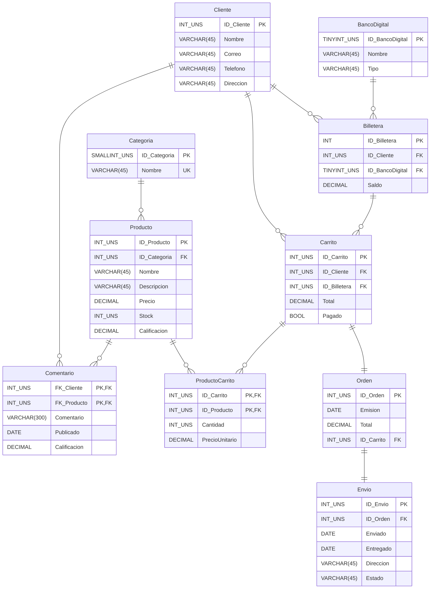

# TIenda-de-envios

## Procedimientos

Procedimientos encargados de dar de alta a las tablas

``` SQL
CREATE PROCEDURE InsBancoDigital (nombre VARCHAR(45), tipo VARCHAR(45))
BEGIN
    INSERT INTO BancoDigital(Nombre, Tipo)
    VALUES (nombre, tipo);
END;
CREATE PROCEDURE InsCategoria (unNombre VARCHAR(45))
BEGIN
    INSERT INTO Categoria(Nombre)
    VALUES (unNombre);
END;
CREATE PROCEDURE InsCliente (unNombre VARCHAR(45), unCorreo VARCHAR(60), unTelefono VARCHAR(10), unDireccion VARCHAR(60))
BEGIN
    INSERT INTO Cliente (Nombre,Correo,Telefono,Direccion)
    VALUES (unNombre, unCorreo, unTelefono, unDireccion);
END;

CREATE PROCEDURE InsBilletera ( unID_Cliente INT UNSIGNED, unID_BancoDigital TINYINT UNSIGNED, unSaldo DECIMAL(10,2) UNSIGNED)
BEGIN
    INSERT INTO Billetera( ID_Cliente, ID_BancoDigital, Saldo)
    VALUES ( unID_Cliente, unID_BancoDigital, unSaldo);
END;

CREATE PROCEDURE InsProducto (unNombre VARCHAR(300), unDescripcion VARCHAR(700), unPrecio DECIMAL(10,2) UNSIGNED , unStock INT UNSIGNED, unID_Categoria INT UNSIGNED)
BEGIN
    INSERT INTO Producto(Nombre, Descripcion, Precio, Stock, ID_Categoria)
    VALUES (unNombre, unDescripcion, unPrecio, unStock, unID_Categoria);
END;

CREATE PROCEDURE InsComentario (unID_Producto INT UNSIGNED, unID_Cliente INT UNSIGNED, unComentario VARCHAR(700), unEstrellas DECIMAL(2,1) UNSIGNED)
BEGIN
    INSERT INTO Comentario(ID_Producto, ID_Cliente, Publicado, Comentario, Estrellas)
    VALUES (unID_Producto, unID_Cliente,CURDATE() ,unComentario, unEstrellas);
END;

CREATE PROCEDURE InsCarrito(unID_Carrito INT UNSIGNED, unID_Cliente INT UNSIGNED, unID_Billetera TINYINT UNSIGNED)
BEGIN
    INSERT INTO Carrito (ID_Carrito, ID_Cliente, ID_Billetera)
    VALUES (unID_Carrito, unID_Cliente, unID_Billetera);
END;

CREATE PROCEDURE InsProductoCarrito ( unID_Carrito INT UNSIGNED, unID_Producto INT UNSIGNED, uncantidad INT UNSIGNED)
BEGIN
    SELECT uncantidad * precio INTO @total 
    FROM Producto
    WHERE ID_Producto=unID_Producto;

    INSERT INTO ProductoCarrito (ID_Carrito, ID_Producto, cantidad, precioUnitario)
    VALUES (unID_Carrito, unID_Producto, uncantidad, @total);
END;

```
